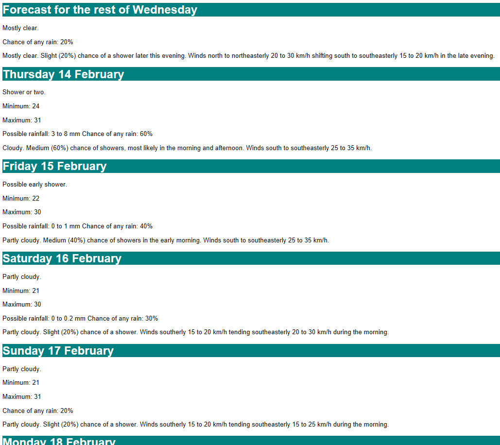

# 7-day Weather Forecast
This application scrapes [the BOM webpage showing the 7-day forecast for Brisbane](http://www.bom.gov.au/qld/forecasts/brisbane.shtml) and redisplays the text in a HTML page.

For each day in the forecast, the following items (where given) are displayed:
* Date
* Summary
* Temperature Range
* Rainfall
* Full Description

The displayed page has the tab title of 
```
BRISBANE 7-day forecast
```

## To run
```sh
pip install -r requirements.txt
python forecast.py
```

## Sample output
